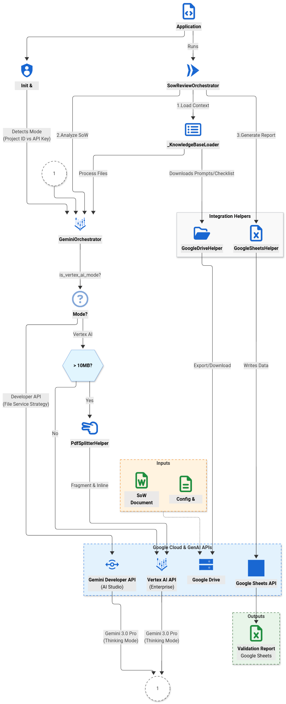

# AI-Powered Statement of Work (SoW) Validator

## 1. Executive Summary

This solution provides a robust, automated framework for the programmatic validation of Statement of Work (SoW) documents. By leveraging the advanced multimodal reasoning capabilities of Google's **Gemini 3.0 Pro** model (with Thinking Mode enabled), this system automates the initial SoW review process against a predefined set of business and technical rules.

The primary business objective is to de-risk project engagements by programmatically identifying inconsistencies, critical omissions, and potential issues in an SoW *before* it is finalized. This reduces manual review hours, accelerates the sales and delivery cycle, and ensures a higher degree of compliance and quality assurance from the outset.

## 2. Design Philosophy

This project is designed with a **Colab-first** approach. The Python (`.py`) files in this repository are not intended to be run as a standalone command-line application. Instead, they are structured as modular, reusable assets (Orchestrators, Helpers) that are designed to be imported and utilized within a **Google Colab Notebook** (`.ipynb`).

This philosophy provides several advantages:
*   **Interactivity:** Allows for step-by-step execution, debugging, and visualization of the validation process.
*   **Rapid Prototyping:** Facilitates easy experimentation with different prompts, documents, and model parameters.
*   **Simplified Authentication:** Seamlessly integrates with Google Colab's native authentication mechanisms for accessing Google Drive, Google Sheets, and Gemini.

## 3. System Architecture

The architecture is designed around a central orchestrator that coordinates a set of specialized helper modules, each responsible for a specific integration. This promotes a clean separation of concerns and enhances maintainability.




### Architectural Justification:
*   **Modularity:** The separation of orchestrators and helpers (e.g., `GeminiOrchestrator`, `GoogleDriveHelper`) allows for independent testing and maintenance. Swapping out a service (e.g., moving from Google Drive to a local file system) would only require modifying the relevant helper, not the core business logic.
*   **Automation-First:** The entire workflow is designed to be executed programmatically, minimizing manual intervention. Configuration is centralized, and credentials are handled based on the execution environment (local vs. Colab).
*   **Dual-Mode Support (Developer & Enterprise):** The system intelligently switches between **Gemini Developer API** and **Vertex AI** modes based on the available credentials, adapting its file handling strategy (File Service vs. Inline Data) automatically.
*   **Resilience:** The use of decorators (`@retry_on_gemini_error`) on API calls within the `GeminiOrchestrator` ensures that the system can gracefully handle transient network failures or API errors.

## 3. Key Features

*   **Multimodal Analysis:** Ingests SoW documents in PDF format, leveraging Gemini's ability to process both text and embedded images (like architecture diagrams) in a single prompt.
*   **Smart File Handling:**
    *   **Developer API:** Uploads files securely using the Gemini File Service.
    *   **Vertex AI:** Uses an intelligent "Inline Data" strategy for files, including a **Dynamic PDF Splitter** that fragments large documents (>10MB) to fit within payload limits without requiring external storage buckets.
*   **Dynamic Knowledge Base:** Loads system instructions, contextual prompts, and validation checklists from external Google Drive/Docs sources, allowing business rules to be updated without code changes.
*   **Thinking Mode:** Utilizes Gemini 3.0 Pro's reasoning capabilities to perform deep analysis before generating the final report.
*   **Automated Report Generation:** Parses the structured analysis from Gemini (in TSV format) and programmatically generates a new Google Sheet report from a predefined template.
*   **Resource Management:** Automatically cleans up temporary resources upon completion of the workflow.

## 4. Prerequisites

*   Python 3.10+
*   Access to a Google Cloud project with the Gemini API enabled.
*   A `GEMINI_API_KEY` with the necessary permissions.
*   A Google Cloud service account or user credentials with permissions for Google Drive and Google Sheets APIs.
*   **Libraries:** `google-genai`, `google-api-python-client`, `pypdf`, `httplib2`.

## 5. Configuration

The application's behavior is controlled by a combination of environment variables and hardcoded constants in `application.py`.

### 5.1. Environment Variables (Colab Secrets)
*   `GEMINI_API_KEY`: **Required.** Your API key for the Gemini service.
*   `GOOGLE_CLOUD_PROJECT`: **Optional (Enables Vertex AI Mode).** The Project ID of your GCP project. If present, the system switches to Vertex AI.
*   `GOOGLE_CLOUD_LOCATION`: **Optional.** The region for Vertex AI (default: `us-central1`).

### 5.2. Core Configuration (`application.py`)
The following constants define the input artifacts for the process:
*   `PROMPT_URL`: A public Google Drive link to a Markdown file containing the system prompt and the sequential priming prompts.
*   `CHECKLIST_URL`: A Google Sheets link to the validation checklist that will be provided to Gemini as context.
*   `TEMPLATE_URL`: A Google Sheets link to the template that will be copied to create the final report.
*   `SOW_URL`: Passed as a command-line argument. The URL of the SoW document to be analyzed.

## 6. Installation & Usage

As this project is designed for Google Colab, the primary method of use is to import and run the orchestrator from within a notebook.

1.  **Clone the repository in your Colab environment:**
    ```python
    !git clone <repository_url>
    %cd <repository_directory>
    ```

2.  **Install dependencies:**
    ```python
    !pip install -r requirements.txt
    ```

3.  **Set up authentication:**
    *   Create a Colab Secret named `GEMINI_API_KEY` with your API key.
    *   (Optional) Create `GOOGLE_CLOUD_PROJECT` to force Vertex AI mode.
    *   The `ColabAuthHelper` will handle the Google Drive/Sheets authentication popup when the application is run.

4.  **Execute the workflow in a Colab cell:**
    Instantiate the `Application` class and call its `run` method with the target SoW URL.
    ```python
    from application import Application

    # --- User Input Parameter ---
    #@markdown 📄 **Paste the SoW URL (Google Doc or Drive file) to be reviewed here:**
    SOW_URL = "PUT WORKSPACE DOCUMENT URL HERE" #@param {type:"string"}
    SOW_URL = SOW_URL.strip()

    # --- System Configuration ---
    #@markdown ⚙️ **System Configuration (URLs):**
    PROMPT_URL    = "PUT_YOUR_PROMPT_URL_HERE" #@param {type:"string"}
    CHECKLIST_URL = "PUT_YOUR_CHECKLIST_URL_HERE" #@param {type:"string"}
    TEMPLATE_URL  = "PUT_YOUR_TEMPLATE_URL_HERE" #@param {type:"string"}
    TARGET_SHEET_NAME = "Checklist Template" #@param {type:"string"}
    START_CELL = "B26"
    GEMINI_MODEL_NAME = "gemini-3-pro-preview"

    # Initialize and run the application in 'colab' mode.
    app = Application(
        environment='colab',
        prompt_url=PROMPT_URL,
        checklist_url=CHECKLIST_URL,
        template_url=TEMPLATE_URL,
        target_sheet_name=TARGET_SHEET_NAME,
        start_cell=START_CELL,
        gemini_model_name=GEMINI_MODEL_NAME
    )
    app.run(sow_url=SOW_URL)
    ```

## 7. Workflow Breakdown

The `SowReviewOrchestrator` executes the validation process in a series of distinct phases:

1.  **Phase 1 & 2: Gemini Session Preparation**
    *   The system downloads and parses the knowledge base, including system instructions and the validation checklist.
    *   Files are prepared based on the mode (Uploaded or Inlined).
    *   A new chat session is initiated with **Gemini 3.0 Pro**, and the context is built sequentially by executing the priming prompts.

2.  **Phase 3: SoW Analysis**
    *   The target SoW document is exported from Google Drive as a PDF.
    *   If in Vertex AI mode and the file is large, it is automatically split into manageable fragments.
    *   The content is passed to Gemini in a multimodal prompt for deep reasoning analysis.

3.  **Phase 4: Report Generation**
    *   The orchestrator receives the analysis from Gemini and uses a regular expression to parse a structured TSV block from the response text.
    *   A new Google Sheet is created by copying the master template.
    *   The parsed TSV data is written into the new sheet at the configured start cell.

4.  **Phase 5: Cleanup**
    *   All temporary files uploaded to the Gemini API (if in Developer API mode) are deleted to prevent resource leakage.
